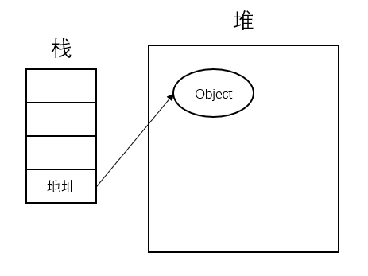
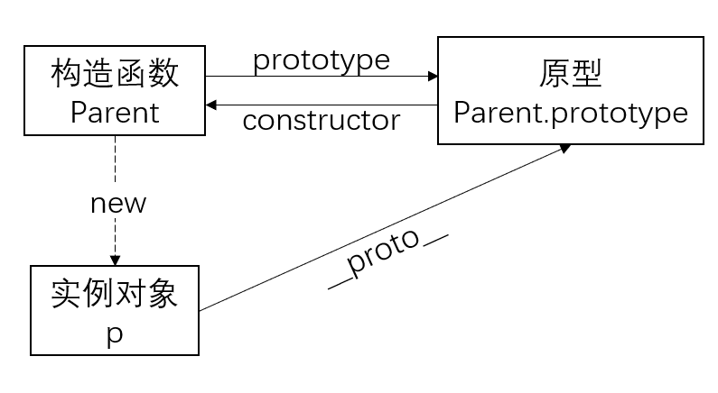
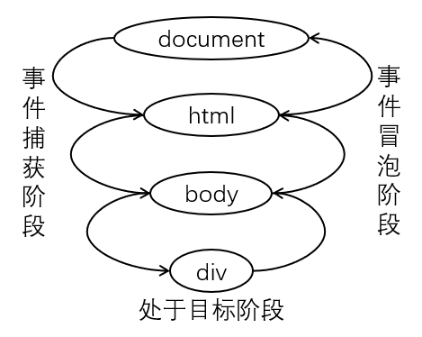
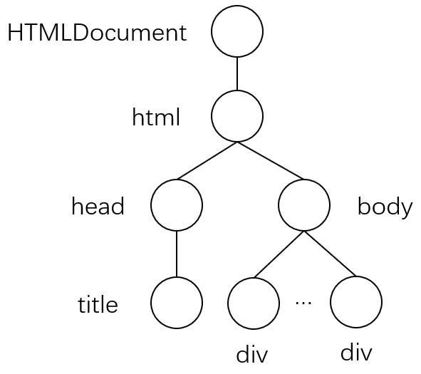
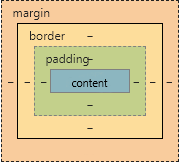

# 前端面经
[JS](#JS)
* [JS数据类型有哪些？](#JS数据类型有哪些？)
* [Null和Undefined的差异？](#Null和Undefined的差异？)
* [var、let和const关键字的区别？](#var、let和const关键字的区别？)
* [为什么var可以重复声明？](#为什么var可以重复声明？)
* [JS中什么是变量提升？什么是暂时性死区？](#JS中什么是变量提升？什么是暂时性死区？)
* [深拷贝和浅拷贝的区别？](#深拷贝和浅拷贝的区别？)
* [什么是闭包？](#什么是闭包？)
* [typeof和instanceof有什么区别？](#typeof和instanceof有什么区别？)
* [什么是原型、原型链？](#什么是原型、原型链？)
* [如何正确判断this关键字的指向？](#如何正确判断this关键字的指向？)
* [JS继承的几种实现方式？](#JS继承的几种实现方式？)
* [JS创建对象的几种方式？](#JS创建对象的几种方式？)
* [new操作符具体干了什么？](#new操作符具体干了什么？)
* [call、apply和bind方法有什么区别？](#call、apply和bind方法有什么区别？)
* [JS异步加载的几种方式？](#JS异步加载的几种方式？)
* [什么是Promise？](#什么是Promise？)
* [async/await的概念？](#async/await的概念？)
* [JS的事件捕获与事件冒泡？](#JS的事件捕获与事件冒泡？)
* [JS事件委托机制？](#JS事件委托机制？)
* [JS事件绑定的几种方式？](#JS事件绑定的几种方式？)
* [Set、Map、WeakSet、WeakMap的区别？](#Set、Map、WeakSet、WeakMap的区别？)
* [谈谈你对ES6的了解（ES6的新特性）？](#谈谈你对ES6的了解（ES6的新特性）？)
* [防抖与节流？](#防抖与节流？)
* [函数柯里化？](#函数柯里化？)
* [什么是window对象，什么是document对象？](#什么是window对象，什么是document对象？)
* [如何编写高性能的JS？](#如何编写高性能的JS？)
* [哪些操作会造成内存泄露？](#哪些操作会造成内存泄露？)
* [谈谈你对模块化的理解？](#谈谈你对模块化的理解？)
* [webpack?](#webpack?)

[HTML](#HTML)
* [什么是DOM？](#什么是DOM？)
* [浏览器是如何渲染页面的？](#浏览器是如何渲染页面的？)
* [script标签的defer和async属性有什么作用？](#script标签的defer和async属性有什么作用？)

[HTTP](#HTTP)
* [平时遇到跨域问题都用什么解决方案？](#平时遇到跨域问题都用什么解决方案？)
* [从输入URL到展示的过程？](#从输入URL到展示的过程？)
* [TCP三次握手？](#TCP三次握手？)
* [HTTP和HTTPS协议的区别？](#HTTP和HTTPS协议的区别？)
* [常见状态码？](#常见状态码？)
* [get和post的区别？](#get和post的区别？)
* [Websocket？](#Websocket？)

[VUE](#VUE)
* [vue的生命周期？](#vue的生命周期？)
* [vue是如何实现双向绑定的？](#vue是如何实现双向绑定的？)
* [vue的组件通信？](#vue的组件通信？)
* [vue的diff算法？](#vue的diff算法？)
* [vue路由的实现原理？](#vue路由的实现原理？)

[CSS](#CSS)
* [页面导入样式时，使用link和@import的区别？](#页面导入样式时，使用link和@import的区别？)
* [伪类和伪元素的区别？](#伪类和伪元素的区别？)
* [CSS中position属性有哪些取值，它们的行为是什么？](#CSS中position属性有哪些取值，它们的行为是什么？)
* [圣杯布局的原理和实现方法？](#圣杯布局的原理和实现方法？)
* [垂直居中如何实现？](#垂直居中如何实现？)
* [CSS样式优先级？](#CSS样式优先级？)
* [CSS盒子模型？](#CSS盒子模型？)

[算法](#算法)
* [快速排序](#快速排序)
* [数组扁平化](#数组扁平化)
* [相交链表](#相交链表)

## JS
### JS数据类型有哪些？
* 基本数据类型：String、Number、Boolean、Null、Undefined、Symbol（ES6新增，表示独一无二的值）；
* 引用类型：Object。
基本数据类型在内存中是栈存储，引用类型是堆存储，引用类型在栈中存放对象的地址，指向堆中的真实数据，如下图所示。栈是自动分配的内存空间，堆是动态分配的内存，大小不定也不会自动释放。



### Null和Undefined的差异？
* 两者都代表无，在if判断语句中，值都为false；
* Null转为数字类型值为0，而Undefined转为数字类型为NaN；
* Null可以作为函数的参数，表示该函数的参数不是对象，同时Null也是对象原型链的终点；
* Undefined表示变量别声明了但是没有赋值。

### var、let和const关键字的区别？
在ES6之前变量作用域只有全局作用域和局部（函数）作用域，没有块作用域，ES6新增let和const关键字来解决这一问题。
* var只有全局作用域和局部作用域的概念，let和const只有块作用域的概念，由{}包括起来；
* var存在变量提升，而let、const不存在变量提升，未声明时是无法访问该变量的；
* const一旦声明必须赋值，声明后不能修改，如果声明的是对象，可以修改其属性；
* 同一作用域下let和const不能声明同名变量，而var可以。
```
// var和let作用域的常见面试题
//知识点：JS的事件循环机制，setTimeout的机制
for(var i = 0; i < 10; i++){
    setTimeout(function(){
        console.log(i);
    }, 0);
}
//输出 10   共10个

for(let i = 0; i < 10; i++){
    setTimeout(function(){
        console.log(i);
    }, 0);
}
//输出 0 1 2 3 4 5 6 7 8 9
```

### 为什么var可以重复声明？
* 编译器在遇到var关键字，会判断变量是否已经声明，如果已经声明则会忽略var直接对变量进行赋值。

### JS中什么是变量提升？什么是暂时性死区？
* 变量提升就是在声明之前就可以使用，值为undefined；而使用let/const声明变量前，该变量都是不可用的，语法上称为“暂时性死区”；
* 暂时性死区的本质就是变量已经存在但是不可获取，只有等到变量被声明时才能获取和使用该变量。
```
// 变量提升
typeof x;   //undefined，不会报错
var x;

// 暂时性死区
typeof y;   //ReferenceError(暂时性死区)
lex y;
```

### 深拷贝和浅拷贝的区别？
* 浅拷贝是复制了对象的引用地址，而非堆中的值，即两个对象指向同一个存储空间，修改其中一个对象的值另一个值也会改变，例如object.assign()；
* 深拷贝将对象及值复制过来，两个对象修改其中的值另一个值都不会改变，例如JSON.parse()和JSON.stringify()。
```
// 自定义函数实现浅拷贝
function shallowCopy(src){
    var dest = {};
    for(var prop in src){
        if(src.hasOwnProperty(prop)){
            dest[prop] = src[prop];
        }
    }
    return dest;
}

// 自定义函数实现深拷贝(递归)
function deepCopy(src){
    if(typeof src !== 'object') return;
    var dest = src instanceof Array ? [] : {};
    for(var prop in src){
        if(src.hasOwnProperty(prop)){
            dest[prop] = typeof src[prop] === 'object' ? deepCopy(src[prop]) : src[prop];
        }
    }
    return dest;
}
```

### 什么是闭包？
闭包就是能取其它函数内部变量的函数，作用：
* 可以读取函数内部的变量；
* 让这些变量的值始终保持在内存中。

由于闭包会使函数变量保存在内存中，所以在浏览器中可能会导致内存泄漏，解决方法是在退出函数时将不使用的局部变量删除。

### typeof和instanceof有什么区别？
JS中使用typeof和instanceof来判断一个变量是什么类型。
* typeof对于基本数据类型除了null（typeof null输出为对象）都可以显示正确类型，对于引用类型除了函数输出'function'，其它输出全是'object'，因此无法准确知道对象的类型；
* instanceof用来判断某个构造函数的prototype属性是否存在于检测对象的原型链上，即一个变量是否属于某个对象的实例，因此，instanceof只能正确判断引用类型。
```
// instanceof实现代码(A instanceof B)
function instace_of(A, B){
    let prototype = B.prototype;
    while(true){
        if(A === null){    //找到A的原型链终点
            return false;
        }else if(A.__proto__ === prototype){
            return true;
        }else{
            A = A.__proto__;    //继续沿原型链向上查找
        }
    }
}
```

### 什么是原型、原型链？
* 每个对象都有一个原型对象，通过__proto__指针指向其原型对象，并从中继承方法和属性，同时原型对象也可能拥有原型，这样一层一层最终指向null（原型链的终点，Object.prototype.__proto__指向null）。这种关系链被称为原型链，通过原型链一个对象可以继承其它对象的方法和属性，是实现继承的主要方式。
* 构造函数Parent、原型Parent.prototype和实例p之间的关系如下图所示（p.__proto__ === Parent.prototype）。
（注：prototype是构造函数的属性，__proto__是每个实例都有的属性，实例的__proto__与其构造函数的prototype指向同一个对象，即该实例的原型）


### 如何正确判断this关键字的指向？
this是一个指针，指向调用函数的对象，this有四种绑定规则：默认绑定、隐式绑定、显示绑定、new绑定。4种规则的优先级为：new绑定 > 显示绑定 > 隐式绑定 > 默认绑定。
* 默认绑定
* 隐式绑定
* 显示绑定
* new绑定

### JS继承的几种实现方式？
* 原型链继承，将父类的实例作为子类的原型；
```
// 定义父类
function Animal(name){  
    this.name = name || 'Animal';    // 属性
    this.sleep = function(){}    // 实例方法
}
Animal.prototype.eat = function(food){}  // 原型方法

// 1、原型链继承
function Cat(){}    // 定义子类
Cat.prototype = new Animal();  // 将父类的实例作为子类的原型
Cat.prototype.name = 'Cat';
```
* 借助构造函数实现继承；
```
// 2、构造函数继承
function Cat(name){
    Animal.call(this);
    this.name = name || 'Cat';
}
var cat = new Cat();
```
* 组合继承；
```
// 3、组合继承
function Cat(name){
    Animal.call(this);
    this.name = name || 'Cat';
}
Cat.prototype = new Animal();
var cat = new Cat();
```
* 寄生组合继承；
```
// 4、寄生组合继承
function Cat(name){
    Animal.call(this);
    this.name = name || 'Cat';
}
(function(){
    var Super = function(){};   //创建一个没有实例方法的类
    Super.prototype = Animal.prototype;
    Cat.prototype = new Super();    //将实例作为子类的原型
})();
var cat = new Cat();
```
* class继承，开发中推荐使用的方式。
```
// 5、class继承
```
### JS创建对象的几种方式？
* 通过Object构造函数创建；
```
var Person = new Object();
```
* 使用对象字面量的方式创建（对象字面量是对象定义的一种简写形式）；
```
var Person = {
    name: 'Tom';
    age: 18;
}
```
* 使用工厂模式创建；
```
function createPerson(name, age, sex){
    var obj = new Object();
    obj.name = name;
    obj.age = age;
    obj.sex = sex;
    return obj;
}
var person = createPerson('Tom', 18, 'man');
```
* 使用构造函数创建；
```
function Person(name, age, sex){
    this.name = name;
    this.age = age;
    this.sex = sex;
}
var person = new Person('Tom', 18, 'man');
```
* 使用原型对象创建
```
function Person(){}
Person.prototype.name = 'Tom';
Person.prototype.age = 18;
Person.prototype.sex = 'man';
var person = new Person();
```
* 组合使用构造函数和原型创建；
```
function Person(name, age, sex){
    this.name = name;
    this.age = age;
    this.sex = sex;
}
Person.prototype = {
    constructor: Person;
}
var person = new Person('Tom', 18, 'man');
```

### new操作符具体干了什么？
new操作可以分为以下4个步骤：
* 创建一个空对象； 
```
// 以var p = new Person()为例
const o = new Object();
```
* 将空对象的__proto__指向构造函数的prototype； 
```
o.__proto__ = Person.prototype;
```
* 将构造函数的this指向空对象，执行构造函数；   
```
var res = Person.call(o);
```
* 判断构造函数的返回值类型，返回新对象；   
```
return typeof res === 'object' ? res : o;
```

### call、apply和bind方法有什么区别？
它们的作用都是用来改变函数中this的指向。
* call和reply的区别在于两者的传参方式不同，除第一个参数都指向this，call的其它参数都会作为函数形参传入，而apply需要将其它参数包裹在数组中传入。
* bind的传参方式和call相同，但是call和apply方法调用后会立即执行，而bind方法调用后会返回一个新的函数，需要手动执行。

### JS异步加载的几种方式？
JS加载方式分为：
* 同步加载/阻塞加载，只有当前加载完成，才能进行下一步操作，默认同步加载是安全的，但可能会造成页面阻塞；
* 异步加载/非阻塞加载，浏览器在执行js的同时，还会继续对后续页面进行处理。

异步加载的方式主要有：
* Script DOM Element；
* onload时的异步加载；
* script标签的defer和async属性；

### 什么是Promise？   
* Promise对象用于异步操作，表示一个尚未完成且预计在未来完成的异步操作。
* Promise对象的状态不受外界影响，有三种状态：<br>
（1）pending：初始状态；<br>
（2）fulfilled：已成功；<br>
（3）rejected：已失败。<br>
只有异步操作的结果可以决定当前是哪一种状态，而且一旦状态改变就不会再变，即Promise对象状态只能由pending变成fulfilled，或由pending变成rejected；
* new Promise在实例化过程中执行的代码是同步进行的，then中的回调才是异步执行的（所有会进入异步的都是指事件回调中的那部分代码）。

```
// 基础用法
const p1 = new Promise(function(resolve, reject){
    if(//异步操作成功){
        resolve(value);
    }else{
        reject(error);
    }
});

p1.then(
    //success
    function(value){},
    //failure
    function(error){}
);
```

Promise对象的几个重要方法：
* Promise.all()，方法接收一个数组作为参数，p1、p2、p3都是Promise实例，p的状态要变成fulfilled，只有p1、p2、p3的状态都变成fulfilled，否则p的状态就变成rejected（类似于电路中的串联）；
```
// 示例
const p = Promise.all([p1, p2, p3]);
```
* Promise.race()，方法也接收一个数组作为参数，p1、p2、p3中哪个状态先发生改变，无论成功或失败，p的状态也会跟着它改变；
```
// 示例
const p = Promise.all([p1, p2, p3]);
```
* Promise.resolve()，将现有对象转换成Promise对象，该实例状态为fulfilled；
* Promise.reject()，返回一个Promise实例，该实例状态为rejected。

### async/await的概念？
* async/await实际上就是Generator的语法糖，在函数前加上async关键字表示将函数声明为异步函数，await表示等待一个异步方法执行完成；
* async函数返回一个Promise对象，return返回值就是then方法中回调函数的参数；
* async函数被调用后会立即执行，一旦遇到await就会先返回，等到异步操作执行完成后，再接着执行函数体后面的语句；

### JS的事件捕获与事件冒泡？
事件就是文档或浏览器窗口发生的一些特定交互瞬间，比如用户点击页面的某个内容，某个页面加载完成等。<br>
事件流描述的是从页面中接收事件的顺序，IE提出的是冒泡流，Netscape提出的是捕获流，两者截然相反。
* 事件捕获：事件开始由不太具体的节点接收，然后逐级向下传播到最具体的元素；
* 事件冒泡：事件开始由最具体的元素接收，然后逐级向上传播到较不具体的节点；
* DOM事件流的三个阶段：事件捕获阶段、处于目标阶段、事件冒泡阶段。示意图如下图所示。<br>


### JS事件委托机制？
应用场景：很多DOM节点都需要监听的情况，如果给每个DOM节点都绑定监听函数，对性能会有极大影响，可以利用事件委托来解决这一问题。<br>
事件委托：利用事件冒泡的机制，委托父节点代为执行事件。
```
// 示例（为每个子节点li添加点击事件）
<ul id="ul">
    <li>1</li>
    <li>2</li>
    <li>3</li>
</ul>

// 不利用事件委托机制实现
// 当li数量很多时，性能将会很差
window.onload = function(){
    var Li = document.getElementById('ul').getElementsByTagName('li');
    for(let i = 0; i < Li.length; i++){
        Li[i].onclick = function(){
            // 触发操作
        }
    }
}

// 利用事件委托机制实现
// 只需要对父节点添加事件
window.onload = function(){
    var Ul = document.getElementById('ul');
    Ul.onclick = function(event){
        var e = event || window.event;
        var target = e.target || e.srcElement;
        if(target.nodeName.toLowerCase() === 'li'){
            // 触发操作
        }
    }
}
```

### JS事件绑定的几种方式？
JS中三种常用的绑定事件的方法：
* 在DOM元素中直接绑定，例如：
```
<input onclick="" type="button" />
```
* 在JavaScript代码中绑定，例如：
```
<input id="input" type="button" />
<script type="text/javascript">
    document.getElementById("input").onclick = function(){}
</script>
```
* 绑定事件监听函数，addEventListener()或attachEvent()，语法：
```
elementObject.addEventListener(eventName, handle, useCapture);  //参数useCapture指是否使用事件捕获，默认为false
elementObject.attachEvent(eventName, handle);
```

### Set、Map、WeakSet、WeakMap的区别？
Set、Map、WeakSet、WeakMap是ES6新增的数据结构。
* Set：成员唯一、无序且不重复，可以遍历。
* WeakSet：成员唯一、无序且不重复，但是成员都是弱引用对象，不能遍历；
* Map：键值对，可以遍历；
* WeakMap：键值对，但是键名为弱引用对象，不能遍历。

### 谈谈你对ES6的了解（ES6的新特性）？
* 新增一种一本数据类型（Symbol）；
* 新增块作用域（let、const）；
* 新增定义类的语法糖（class）；
* 新增箭头函数；
* 新增数据结构（Set、Map、WeakSet、WeakMap）；
* 新增模块化（import/export）；
* 新增Proxy构造函数，用来生成proxy示例。

### 防抖与节流？
* 应用场景：对于短时间内连续触发的事件，例如scroll、mousemove等，不希望事件连续触发的过程中频繁地执行函数。
* 防抖：触发事件后在某个时间期限后，执行函数，如果在时间期限内又触发了事件，则会重新计时。
```
/**
*   fn 需要防抖的函数
*   delay 防抖期限值
*/
function debounce(fn, delay){
    let timeout = null;
    return function(){
        if(timeout){
            clearTimeout(timeout);
        }
        timeout = setTimeout(fn, delay);
    }
}
```

如果在时间期限内，不断触发事件，采用防抖的方法将会永远无法执行函数，因此需要新的方案。
* 节流：函数在执行一次后，该函数在指定的时间期限内将失效，直到过了这段时间才重新生效。
```
/**
*   fn 需要防抖的函数
*   delay 防抖期限值
*/
function throttle(fn, delay){
    let valid = true;
    return function(){
        if(!valid){
            return false;   //失效
        }
        valid = false;
        //也可以使用时间戳实现
        setTimeout(() => {
            fn();
            valid = true;
        }, delay);
    }
}
```

### 函数柯里化？
函数柯里化就是只传递给函数一部分参数来调用它，让它返回一个函数去处理剩下的参数。示例：
```
// 普通的add函数
function add(x, y){
    return x + y;
}

// 柯里化后的add函数
function curryingAdd(x){
    return function(y){
        return x + y;
    }
}
```
函数柯里化的作用：
* 参数复用，减少代码冗余，增加可读性；
* 延迟运行，JS种bind的实现机制就是柯里化。
柯里化的实现方式：
```
function curry(fn, curArgs){
    return function(){
        let args = [].slice.call(arguments);
        if(curArgs !== undefined){
            args = args.concat(curArgs);
        }
        //递归调用
        if(args.length < fn.length){
            return curry(fn, args);
        }
        //递归出口
        return fn.apply(null, args);
    }
}

//测试
function sum(a, b, c){
    return a + b + c;
}
const fn = curry(sum);
fn(1, 2, 3);    //return 6
fn(1, 2)(3);    //return 6
fn(1)(2)(3);    //return 6
```

### 什么是window对象，什么是document对象？

### 如何编写高性能的JS？
* 遵循严格模式："use strict"；

### 哪些操作会造成内存泄露？
内存泄漏是指不再需要的对象仍然存在于内存中，根据JS的垃圾回收机制，垃圾回收器会定时扫描对象，如果一个对象的引用计数为0，该对象的内存就会被回收。因此，如果一个不再需要的对象仍然被其它对象引用，就会造成内存泄漏。造成内存泄露的常见操作有：
* 全局变量；
* 闭包；
* 没有清理的DOM元素引用；
* 被遗忘的计时器或者回调函数；
* 循环引用。

### 谈谈你对模块化的理解？

### webpack?

### 微任务、宏任务与事件轮询/事件循环（Event Loop）？

## HTML
### HTML行内元素和块级元素的区别？
* 行内元素（内联元素）：和其它行内元素在同一行，不可设置宽高，只能容纳文本或者其它行内元素；
* 块级元素：总是在新的一行开始排列，可以设置宽高，可以容纳其它块级元素和行内元素；
* 可以通过修改display属性对行内元素和块级元素进行切换；
* 常见行内元素：a、span、img、input、textarea、select、button等；
* 常见块级元素：div、p、h1~h6、ul、li、header、footer、section等。

### 什么是DOM？
DOM，即文档对象模型。DOM将HTML文档表达为树结构（DOM树、CSSOM树、渲染树），可以通过DOM访问和操作HTML文档的内容。

### 什么是Virtual DOM？
Virtual DOM，即虚拟节点。首先需要明白为什么要使用虚拟DOM，为实现数据变化时页面也随之变化，有如下几种实现方式：
* 重新构建整个DOM树，重新渲染；（效率低下）
* 遍历整个DOM树，查找数据变化的节点，重新渲染该节点；（实现困难）
* 当数据变化时，建立新的虚拟DOM树，比较新的虚拟DOM树和旧的虚拟DOM树的差异，将差异运用到真正的DOM树上。（实现简单，效率较高）

Virtual DOM算法的实现过程：
* 用JS对象模拟DOM树；
* 比较新旧虚拟DOM树的差异（Virtual DOM的diff算法）；
* 将差异运用到真正的DOM树上。

[深度剖析：如何实现一个 Virtual DOM 算法 #13](https://github.com/livoras/blog/issues/13)

### 浏览器是如何渲染页面的？
浏览器从HTTP服务器获取响应报文（HTML文档），到呈现页面给用户，分为如下几个步骤：
* 构建DOM树，DOM树是以HTMLDocument为根节点，其余节点为子节点组成的一棵树，示意图如下图所示。<br>
<br>
HTML解释器将HTML文档构建为DOM树的过程过下：<br>
（1）字节流（Bytes）；<br>
（2）被解码为字符流（Characters）；<br>
（3）被词法解析器解释成词语（Tokens）；<br>
（4）被语法分析器构建成各种节点；<br>
（5）组建成一棵DOM树。<br> 
在HTML解释器构建DOM树过程，可能会有JavaScript代码需要下载和执行，而JavaScript代码的下载和执行会阻塞文档的解析。因此，为防止页面阻塞，可以合理使用script标签的defer和async属性，或者将script元素放在body元素的最后面，提高用户体验。

* 构建CSSOM树，构建DOM树过程中文档head遇到link标记引用外部CSS样式表，会进行CSSOM树的构建。CSSOM树和DOM树构建过程相同，CSSOM树生成节点时，每个节点首先会继承父节点的所有样式，然后根据优先级对样式进行覆盖。
* 构建渲染树，渲染树由DOM树和CSSOM树合并而成；
* 布局与绘制页面<br>
布局：浏览器按照从上到下、从左到右的顺序读取渲染树的节点，放到文档流上，如果节点A是节点B的子节点，在放入文档流时就应该将节点A按顺序放入到节点B的内部，这样浏览器就计算出了每个节点该放在页面哪个位置。<br>
绘制：布局完成后，浏览器就将所有节点绘制出来，完成页面的渲染。

### script标签的defer和async属性有什么作用？
HTML解释器在构建DOM树过程中，如果遇到script标签（没有defer或async属性），会立即加载并执行其中的JavaScript代码，造成文档解析的阻塞。script标签的defer和async属性能使解释器异步加载JavaScript代码。
* defer：文档解析和JavaScript代码的加载（不执行）是异步执行的，JavaScript代码的执行需要等到文档中所有元素解析完成之后，DOMContentLoaded事件触发执行之前。如果存在多个defer属性的JavaScript代码，它们按照加载顺序执行；
* async：文档解析和JavaScript代码的加载是异步执行的，JavaScript代码加载完成后会立即执行，此时文档解析会停止。

### DOMContentLoaded和load的区别？
DOMContentLoaded在HTML文档加载和解析完成之后触发，无需等待样式表、图像和子框架的完成加载，而load在HTML所有相关资源被加载完成后触发。

## HTTP
### 平时遇到跨域问题都用什么解决方案？
跨域是指浏览器不能执行其它网站的脚本，是由浏览器的同源策略造成的。同源策略是浏览器最基本也是最核心的安全策略，所谓同源是指：协议、域名、端口号都相同，只要有一个不同，就是非同源。

跨域的常见解决方案有以下几种：
* 通过jsonp跨域；
* document.domain；
* nginx代理跨域；
* ...

### 从输入URL到展示的过程？
* DNS解析，为方便用户访问互联网，Internet将域名和IP地址进行映射，用户可以通过域名访问网站，而不用去记住它的IP地址。通过域名得到主机对应的IP地址的过程就是DNS解析；<br>
DNS查询的两种方式：递归查询和迭代查询；
* TCP三次握手；
* 客户端（浏览器）发送HTTP请求；
* 服务器处理请求并返回HTTP报文；
* 浏览器根据响应报文对页面进行渲染；
* 断开TCP连接。

### TCP三次握手？

### HTTP和HTTPS协议的区别？

### 常见状态码？
1.消息；2.成功；3.重定向；4.请求错误；5.服务器错误。

### get和post的区别？

### Websocket？

## VUE
### vue的生命周期？

### vue是如何实现双向绑定的？
* vue2使用Object.defineProperty进行双向绑定，vue3使用proxy取代之。

### vue的组件通信？

### vue的diff算法？

### vue路由的实现原理？

## CSS 
### 页面导入样式时，使用link和@import的区别？
* link是XHTML标签，除了加载CSS之外，还能定义rel连接属性等作用，而@import由CSS提供，只能加载CSS；
* link引用CSS时，在页面载入时同时加载，而@import需要页面完全载入以后加载；
* link是XHTML标签，无兼容问题，而@import是CSS2.1提出的，低版本的浏览器不支持；
* link支持JS控制DOM去改变样式，而@import不支持。

### 伪类和伪元素的区别？
CSS规定伪类使用一个冒号(:)来表示，伪元素使用两个冒号(::)来表示。
* 常见的伪类有:hover, :active, :focus, :visited, :first-child, :last-child等；
* 常见的伪元素有::before, ::after等。

### CSS中position属性有哪些取值，它们的行为是什么？
position属性的常用取值有：static、fixed、absolute、relative。
* static，是position属性的默认值，指无特殊定位；
* fixed，相对浏览器窗口进行定位；
* absolute，绝对定位，相对于static定位之外的第一个父元素进行定位；
* relative，相对定位，相对于正常位置进行定位。

### CSS中display属性有哪些取值，它们的行为是什么？

### 圣杯布局的原理和实现方法？
圣杯布局解决的问题：中间宽度自适应、两边定宽的三栏布局，且中间栏要放在文档流前面优先渲染。

原理：使用浮动、相对定位和负边距。
```
// HTML代码
<div class="content">
    <div class="center col"></div>
    <div class="left col"></div>
    <div class="right col"></div>
</div>

// CSS代码
.content {
    padding: 0 100px;
}
.col {
    float: left;
    height: 200px;
    position: relative;
}
.left, .right {
    width: 100px;
}
.left {
    background: blue;
    margin-left: -100%;
    right: 100px;
}
.right {
    background: green;
    margin-left: -100px;
    left: 100px;
}
.center {
    width: 100%;
    background: pink;
}
```

### 垂直居中如何实现？

### CSS样式优先级？
HTML中的style样式>内联样式>外部样式>用户设置>浏览器默认样式

### CSS盒子模型？
盒子模型就是把HTML元素看作一个矩形的盒子，每个矩形都由元素的内容（content）、内边距（padding）、边框（border）和外边距（margin）组成。矩形盒子描述了一个文档元素在页面布局中的位置和大小。下图就是盒子模型的示意图：<br>


* 每个盒子都有内容、内边距、边框、外边距4个属性，每个属性都包括上、右、下、左4个部分；
* content，即设置盒子的宽度（width）和高度（height）；
* padding：上 右 下 左（取值个数不同，表示的意思也不同）；
* border：border-width || border-style || border-color（综合写法，3个子属性的顺序不能写错）；
* margin：上 右 下 左（取值个数不同，表示的意思也不同），margin属性存在外边距合并现象，即：<br>
（1）上下相邻的块元素垂直外边距合并：上下相邻的两个块元素，如果上面的元素有下外边距margin-bottom，同时下面的元素有上外边距margin-top，那么它们之间的垂直间距不是margin-bottom与margin-top之和，而是两者中的较大者；<br>
（2）嵌套块元素垂直外边距合并：两个父子关系的块元素，如果父元素上内边距和边框，父元素的上外边距会与子元素的上外边距发生合并，合并的外边距为两者中的较大者。
* 根据盒子模型布局的稳定性，应该优先使用width和height，其次使用padding，再考虑使用margin。

其它与盒子模型相关的属性：
* border-radius（圆角边框）：上 右 下 左（取值个数不同，表示的意思也不同）；
* box-shadow（盒子阴影）：h-shadow v-shadow blur spread color inset（前两个取值必须，其余可以省略）。

## 算法
### 快速排序

### 数组扁平化
将一个多维数组变为一个一维数组，例如：[1, 2, [3, [4, 5]]] --> [1, 2, 3, 4, 5]。
```
// 1.递归
function flatten(arr){
    var res = [];
    for(let i = 0; i < arr.length; i++){
        if(Array.isArray(arr[i])){
            res = res.concat(flatten(arr[i]));
        }else{
            res.push(arr[i]);
        }
    }
    return res;
}

// 2.toString & split
function flatten(arr){
    return arr.toString().split(',').map(function(item){
        return parseInt(item);
    })
}

// 3.join & split
function flatten(arr){
    return arr.join(',').split(',').map(function(item){
        return parseInt(item);
    })
}

// 其它：reduce
         ES6扩展运算符 [].concat(...[1, 2, [3, [4, 5]]]);
```

### 相交链表
找出两个单链表相交的起始节点。
```
// 注意：两个单链表相交不会出现X型交叉，因为单链表每个节点只有一个next指针域
```