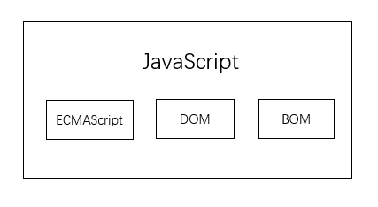
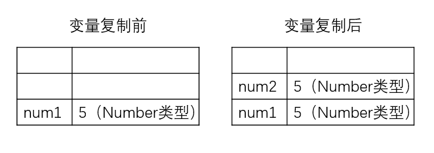
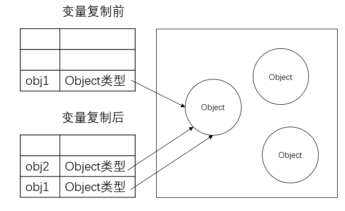

## 读书总结

### <<JavaScript 高级程序设计 第 4 版>>

1. JavaScript 与 ECMAScript

- ECMAScript 是 JavaScript 的核心，各个浏览器均以 ECMAScript 作为自己 JavaScript 实现的依据，具体实现各有不同。完整的 JavaScript 包含三个部分：（1）核心（ECMAScript）；（2）文档对象模型（DOM）；（3）浏览器对象模型（BOM）。如下图所示。<br>

  

2. ECMAScript 版本

- ES6/ES2015：新增类、模块、迭代器、生成器、箭头函数、期约、反射、代理和众多新的数据类型；
- ES7：新增 Array.prototype.includes 和指数操作符；
- ES8：新增异步函数（async/await）、SharedArrayBuffer、Atomics API、Object.values()/Object.entries()/Object.getOwnPropertyDescriptors()和字符串填充方法；
- ES9：新增异步迭代、Promise finally()；
- ES10：
- ES11：

3. DOM

- DOM（文档对象模型）：提供与网页内容交互的方法和接口

4. BOM

- BOM（浏览器对象模型）：提供与浏览器交互的方法和接口

5. script 标签

- 将 JavaScript 插入 HTML 的主要方法是使用 script 标签，script 标签共有 8 个属性：async、charset、crossorigin、defer、integrity、language、src 和 type。
- 如果 type 属性值为 module，则代码会被当成 ES6 模块，只有这时候代码中才能出现 import 和 export 关键字；
- script 标签的使用方式有两种：（1）直接在网页中嵌入 JavaScript 代码；（2）在网页中包含外部 JavaScript 文件（更推荐使用外部文件的方式），例如：

```javascript
<script src="example.js"></script>
```

6. ECMAScript 语法

- ECMAScript 中一切都区分大小写，例如，变量 test 和变量 Test 是两个不同的变量；
- 标识符，即变量、函数、属性或函数参数的名称，根据惯例，ECMAScript 标识符使用驼峰大小写的形式，即第一个单词的首字母小写，后面每个单词的首字母大写；
- 严格模式："use strict"。

7. ECMAScript 变量

- ECMAScript 变量是松散类型的，即变量可以保存任何类型的数据，声明变量可以使用 var、let 和 const （let 和 const 为 ES6 新增 ）这 3 个关键字，不同数据类型的变量初始化可以在同一条语句中声明；
- let 声明的是块作用域，var 声明的是函数作用域，例如：

```javascript
if (true) {
  var name = "Tom"; // 函数作用域
  console.log(name); // Tom
}
console.log(name); // Tom
```

```javascript
if (true) {
  let name = "Tom"; // 块作用域
  console.log(name); // Tom
}
console.log(name); // ReferenceError: name未定义
```

- let 在全局作用域中声明的变量不会成为 window 的属性，而 var 声明的变量会；
- 只使用 let 和 const 有助于提高代码质量，const 优先，let 次之。

8. ECMAScript 数据类型

- 6 种简单数据类型/原始类型：Undefined、Null、Boolean、Number、String 和 Symbol（ES6 新增）；
- 1 种复杂数据类型/引用类型：Object/对象。

- typeof 操作符：注意 typeof null 返回"object"；
- Undefined 类型只有一个值即 undefined， 值为 undefined 的变量是 指该变量声明了但未初始化；
- Null 类型也只有一个值即 null，null 值表示一个空对象指针，这就是为什么 typeof null 返回的是"object"；
- Boolean 类型有两个字面值：true 和 false。这两个布尔值不同于数值，即 true 不等于 1，false 不等于 0，但是其他类型的值都能与布尔值进行转换，在 if 等流控制语句中其他类型值会自动转换为布尔值；
- Number 类型
- String 类型
- Symbol 类型：用来确保对象属性使用唯一标识符，不会发生属性冲突。使用 Symbol()函数进行初始化，Symbol()函数不能与 new 关键字一起作为构造函数使用，例如：

```javascript
let n = new Number();
console.log(typeof n); // "object"

let s = new Symbol(); // TypeError: Symbol is not a constructor
```

- Object 类型，Object 是所有对象的基类。

9. 原始值与引用值

- 原始值保存在栈内存上，引用值保存在堆内存上；
- 保存原始值的变量是按值访问的，保存引用值的变量是按引用访问的；
- 原始值不能有属性，只有引用值可以动态添加后面可以使用的属性；
- 原始类型的初始化只能使用原始字面量形式，如果使用 new 关键字，会创建一个 Object 类型的实例；
- 通过变量把原始值赋值给另一个变量时，两个变量是完全独立的；

```javascript
let num1 = 5;
let num2 = num1;
```

  

- 通过变量把引用值赋值给另一个变量时，存储在变量中的值也会被复制到新变量所在的位置，这里复制的实际上是一个指针，它指向存储在堆内存中的对象；

```javascript
let obj1 = new Object();
let obj2 = obj1;
obj1.name = "Tom";
console.log(obj2.name); // "Tom"
```



- ECMAScript 所有函数的参数都是按值传递的，ECMAScript 中函数的参数就是局部变量。

10. 变量作用域

- 搜索标识符表示什么过程如下：搜索开始于作用域前端，如果在局部上下文找到该标识符，则搜索停止，变量确定；如果没有找到变量名，则继续沿作用域链搜索。如果搜索到全局上下文，仍然没有找到该标识符，则说明该变量未声明。例如：

```javascript
var color = "blue";
function getColor() {
  let color = "red";
  {
    let color = "green";
    return color;
  }
}

console.log(getColor()); // "green"
```

11. 垃圾回收与内存管理

- JavaScript 是使用垃圾回收的语言，垃圾收集器会定时、周期性地找出不再继续使用的变量，然后释放其占用的内存。标识无用变量的策略通常有两种：<br>
  （1）标记清除（最常用）：垃圾收集器会给内存中所有变量都加上标识，然后去掉环境中的变量和被环境中变量引用的变量的标识，之后仍然被加上标识的变量就会被垃圾收集器回收所占用的内存。<br>
  （2）引用计数：跟踪每个值被引用的次数，当这个值的引用次数变为 0，其占用的内存空间就会被回收。

- 将内存占用量保持在一个较小的值可以让页面性能更好，优化内存占用的最佳手段就是保证在执行代码时只保存必要的数据。如果数据不再必要，就解除引用，比如把它设置为 null；

12. 原始值包装类型

- ECMAScript 提供了 3 种特殊的引用类型：Boolean、Number 和 String。

```javascript
let s1 = "hello world";
let s2 = s1.substring(2); // "llo world"
```

- 在上面的示例中，s1 是一个原始值，从逻辑上讲不应该有方法，实际上后台进行了特殊的处理：<br>
  （1）创建一个 String 包装类型的示例；<br>
  （2）调用实例上的 substring 方法；<br>
  （3）销毁实例。
- 对象的生命周期：通过 new 实例化引用类型后，得到的实例会在离开作用域时被销毁，而自动创建的原始值包装对象只存在于访问它的那行代码执行期间，这就意味着不能给原始值添加属性和方法。
- 使用 new 调用原始值包装类型的构造函数，和调用同名的转型函数并不一样。

```javascript
let value = "25";
let number = Number(value); // 转型函数
console.log(typeof number); // "number"
let obj = new Number(value); // 构造函数，但不推荐显式创建原始值包装类型的示例
console.log(typeof obj); // "object"
```

13. 内置对象

- 除了 Object、Array、Function 和原始值包装对象，ECMAScript 还定义了另外 2 种内置对象：Global 和 Math；
- Global：
- Math：

14. 引用类型

- Object
- Array：数组中每个槽位可以存储任意类型的数据，即可以创建一个数组，它的第一个元素是字符串，第二个元素是数值，第三个元素是对象。ECMAScript 数组是动态大小的，会随着数据添加而自动增长；
- 定型数组
- Map（ES6 新增）：键/值对，与 Object 只能使用数值、字符串和符号作为键不同，Map 可以使用任何 JavaScript 数据类型作为键；
- WeakMap（ES6 新增）：弱映射，WeakMap 中的 “weak” 描述的是 JavaScript 垃圾回收程序对待弱映射中键的方式。弱映射中的键只能是 Object 或继承自 Object 的类型，使用非对象设置键会抛出 TypeError，值类型没有限制；WeakMap 中的键不属于正式的引用，不会阻止垃圾回收；WeakMap 无法对键/值对进行迭代。
- Set（ES6 新增）：一种新的集合类型，Set 可以包含任何 JavaScript 数据类型作为值；
- WeakSet（ES6 新增）：弱集合，WeakSet 中的 “weak” 描述的是 JavaScript 垃圾回收程序对待弱集合中值的方式。弱集合中的值只能是 Object 或继承自 Object 的类型，使用非对象设置键会抛出 TypeError。WeakSet 中的值不属于正式的引用，不会阻止垃圾回收。WeakSet 无法对值进行迭代。
- Function

15. 迭代器

- ES5 新增 Array.prototype.forEach()进行迭代，但 forEach()方法无法标识迭代何时终止；

```javascript
let arr = ["foo", "bar", "app"];
arr.forEach(item => {
  console.log(item);
});
```

- ES6 新增迭代器模式，字符串、数组、Map、Set、arguments 对象和 NodeList 等 DOM 集合类型都实现了 Iterable 接口（可迭代协议）。任何实现 Iterable 接口的对象都有 Symbol.iterator 属性。如果对象原型链上父类实现了 Iterable 接口，那么这个对象也实现了这个接口。通过调用迭代器工厂函数会生成一个迭代器，例如：

```javascript
let str = "abc";
console.log(str[Symbol.iterator]()); // StringIterator {}
```

- 迭代器使用 next()方法在可迭代对象中遍历数据，成功返回的迭代器对象 IteratorResult 包含两个属性：done 和 value。done 是布尔值，表示是否还可以再次调用 next()取下一个值，取 true 是表示“耗尽”，value 包含迭代对象的下一个值。

16. 生成器

- ES6 新增的结构，可以在一个函数块内暂停和恢复代码的执行；

- 生成器的形式是一个函数，函数名称前加一个星号（\*）表示它是一个生成器（标识生成器函数的星号不受两侧空格的影响），箭头函数不能用来定义生成器函数，示例：

```javascript
// 生成器函数声明
function* generatorFn() {}

// 生成器函数表达式
let generatorFn = function*() {};

// 作为对象字面量方法的生成器函数
let foo = {
  *generatorFn() {}
};

// 作为类实例方法的生成器函数
class Foo {
  *generatorFn() {}
}

// 作为类静态方法的生成器函数
class Foo {
  static *generatorFn() {}
}
```

- 调用生成器函数会产生一个生成器对象，生成器对象开始处于暂停执行（suspended）状态，生成器对象也实现了 Iterator 接口，具有 next()方法，调用 next()方法会让生成器开始或恢复执行；

- yield 关键字可以让生成器停止和开始执行，生成器函数在遇到 yield 之前会正常执行，遇到 yield 之后执行会停止，函数作用域的状态会被保留，只能通过调用 next()方法来恢复执行；

- yield 关键字只能在生成器函数内部使用，出现在嵌套的非生成器函数中会抛出语法错误；

17. 对象

- ECMAScript 将对象定义为一组属性的无序集合，对象的每个属性和方法都由一个名称标识，这个名称映射到一个值，可以把 ECMAScript 中的对象想象为一张散列表，其中内容就是名/值对，值可以是数据或函数；

- 对象的属性分为两种：数据属性和访问器属性。

- 数据属性有 4 个特性描述它们的行为：[[Configurable]]、[[Enumerable]]、[[Writable]]和[[Value]]，要修改属性的默认特征，必须使用 Object.defineProperty()方法，示例：

```javascript
let person = {};
Object.defineProperty(person, "name", {
  writable: false, // 只读
  value: "Nicholas"
});
console.log(person.name); // "Nicholas"
person.name = "Greg";
console.log(person.name); // "Nicholas"
```

- 虽然对于同一属性可以多次调用 Object.defineProperty()，但在 configurable 值设为 false 后再次调用就会报错。同时在调用 Object.defineProperty()时，configurable、enumerable 和 writable 的值如果不指定，就默认为 false；

- 访问器属性不包含数据值，有 4 个特性描述它们的行为：[[Configurable]]、[[Enumerable]]、[[Get]]和[[Set]]，访问器属性是不能直接定义的，必须使用 Object.defineProperty()；

- 可以通过 Object.defineProperties()方法一次性定义多个属性；

- 可以使用 Object.getOwnPropertyDescriptor()和 Object.getOwnPropertyDescriptors()（ES7 新增）方法读取属性的特性；

- ES6 新增 Object.assign()方法用来合并对象，该方法接受一个目标对象和一个或多个源对象作为参数，然后将每个源对象中的可枚举（Object.propertyIsEnumerable()返回 true）和只有（Object.hasOwnProperty()返回 true）属性复制到目标对象。如果多个源对象都有相同的属性，则使用最后一个复制的值。示例：

```javascript
let dest = {},
  a = { id: "a" },
  b = { id: "b" };
// 浅拷贝
let res = Object.assign(dest, a, b);
console.log(res === dest); // true
```

- 对象相等判定：ES6 之前使用 === 操作符进行判断，但有些特殊情况 === 无能为力，因此，ES6 新增 Object.is()方法来判定对象是否相等。

18. 扩展操作符

### 《工程数学线性代数 第六版》

1. 行列式

- 利用行列式求解二元线性方程组<br>

$$
\begin{cases}
a_{11}x_1+a_{12}x_2=b_1 \tag 1 \\
a_{21}x_1+a_{22}x_2=b_2 \\
\end{cases}
$$

方程组(1)的解为：

$$
\begin{cases}
x_1=\frac{b_1a_{22}-a_{12}b_2}{a_{11}a_{22}-a_{12}a_{21}} \\ & \text{if $a_{11}a_{22}-a_{12}a_{21} != 0$} \\
x_1=\frac{a_{11}b_2-b_1a_{21}}{a_{11}a_{22}-a_{12}a_{21}} \\
\end{cases}
$$

使用行列式进行表示：
$ D=\begin{vmatrix} a_{11} & a_{12} \\ a_{21} & a_{22} \\ \end{vmatrix}, 
D_1=\begin{vmatrix} b_1 & a_{12} \\ b_2 & a_{22} \\ \end{vmatrix}, 
D_2=\begin{vmatrix} a_{11} & b_1 \\ a_{21} & b_2 \\ \end{vmatrix}$

则：
$ x_1=\frac{D_1}{D}, x_2=\frac{D_2}{D} $

- 全排列：把 n 个不同的元素排成一列，叫做这 n 个元素的全排列。对于 n 个不同的元素，先规定各元素之间有个标准次序（例如规定从小到大为标准次序），当 1 对元素的先后次序与标准次序不同，就构成 1 个逆序。逆序数为奇数的排列叫做奇排列，逆序数为偶数的排列叫做偶排列。

- 对换：一个排列中任意两个元素对换，排列改变奇偶性。

- 行列式的一些性质：<br>
  （1）行列式和它的转置行列式相等；<br>
  （2）对换行列式的两行（列），行列式变号；<br>
  （3）行列式的某一行（列）中所有元素都乘以同一数 K，等于数 K 乘此行列式；<br>
  （4）行列式中有两行（列）元素成比例，则此行列式等于 0；<br>
  （5）若行列式中某一行（列）的元素都是两数之和，则该行列式等于下列两个行列式之和；<br>
  （6）把行列式的某一行（列）的各元素乘同一个数然后加到另一行（列）对应的元素上去，行列式不变。

- 代数余子式
